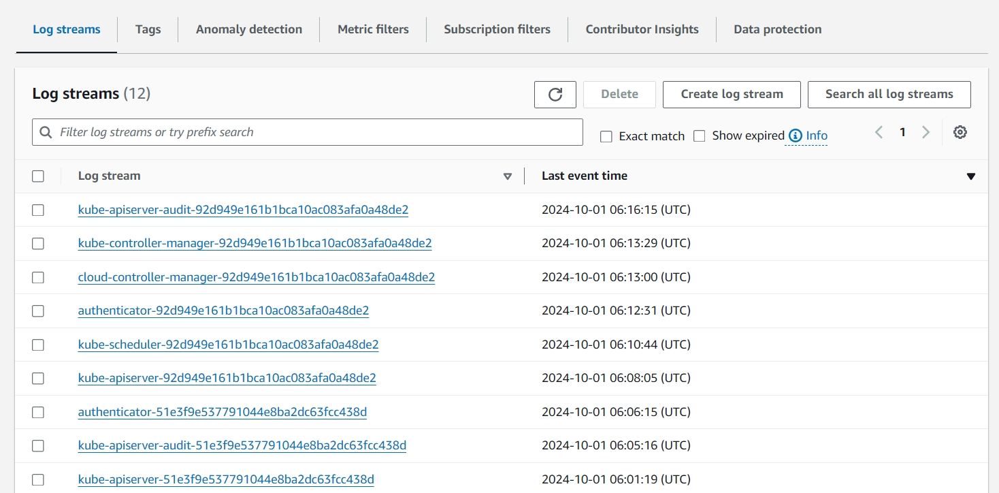

# AWS EKS Terraform Setup with Kubernetes and ArgoCD

This project contains Terraform scripts and Kubernetes configurations for setting up AWS Elastic Kubernetes Service (EKS) clusters, deploying ArgoCD for continuous delivery, and configuring various AWS and Kubernetes components such as IAM roles, autoscalers, RDS databases, and more.

# Table of Contents

- **Introduction**
- **Prerequisites**
- **Installation**
- **File Descriptions**
- **Configuration**

# Introduction

This repository automates the deployment and management of AWS EKS clusters using Terraform and provides additional configurations for:

**AWS IAM:** Sets up roles and policies for EKS, including for load balancers and node groups.

**RDS:** Amazon RDS (Relational Database Service) is a managed database service provided by AWS that simplifies the process of setting up, operating, and scaling relational databases in the cloud

**AWS-LBC:** AWS ALB (Application Load Balancer) Controller is a Kubernetes controller that integrates with AWS Elastic Load Balancing (ELB), specifically focusing on the Application Load Balancer (ALB) and Network Load Balancer (NLB).

**VPC:** AWS Virtual Private Cloud (VPC) is a service that lets you create a logically isolated network within the Amazon Web Services (AWS) cloud. This network can host and control your cloud resources, such as EC2 instances, RDS databases, and Lambda functions.

**EKS:** Amazon Elastic Kubernetes Service (EKS) is a fully managed service from AWS that allows you to run Kubernetes on AWS without needing to install, operate, or maintain your own Kubernetes control plane or nodes.

**EBS:** Amazon Elastic Block Store (EBS) is a scalable, high-performance block storage service provided by AWS. It is designed to be used with Amazon EC2 (Elastic Compute Cloud) instances, providing persistent storage for data that requires low-latency and high throughput.

**AWS Secrets Manager:** Securely stores sensitive data like credentials and keys.

**ArgoCD:** ArgoCD is a declarative, GitOps-based continuous delivery (CD) tool for Kubernetes. It automates the deployment and lifecycle management of applications within Kubernetes clusters, ensuring that the desired state of applications, as defined in Git repositories, matches what is actually running in the cluster

**HPA:** HPA (Horizontal Pod Autoscaler) is a Kubernetes resource that automatically scales the number of pods in a deployment, replica set, or stateful set based on observed metrics such as CPU utilization, memory usage, or custom metrics.

**CloudWatch:** Amazon CloudWatch is a monitoring and management service built for developers, system operators, and IT managers. It provides data and actionable insights for AWS resources, on-premises servers, and other cloud services.

# Prerequisites

Ensure the following tools are installed on your local environment:

- **Terraform** (>= 1.0)
- **AWS CLI**
- **Kubectl** (Kubernetes CLI)
- **Helm** (for managing Kubernetes packages)
- **ArgoCD CLI** (optional but recommended)

# Installation

To deploy the infrastructure, follow these steps:

Clone the repository:

**git clone** (https://github.com/EmreYsrc/apps.git)

- cd terraform

- Initialize Terraform
**terraform init**

- Validate configuration
**terraform validate**

- Apply the configuration
**terraform apply**

This will create the VPC, AWS EKS cluster, AWS RDS, EBS CSI Driver, AWS Load Balancer Controller configure the necessary IAM roles, and set up resources as defined in the Terraform scripts.

# File Descriptions

Here is an overview of the key files included in this project:

- argocd.tf: Defines the ArgoCD setup and deployment on the EKS cluster.
- aws-ingress-class.tf: Defines the AWS-specific ingress class for managing external traffic routing in Kubernetes.
- aws-lbc-datasources.tf: Datasources configuration for AWS Load Balancer Controller.
- aws-lbc-iam-policy-and-role.tf: IAM policies and roles for AWS Load Balancer Controller.
- aws-lbc-install.tf: Create AWS Load Balancer Controller
- cloudwatch.tf: Configures AWS CloudWatch for monitoring EKS and related resources.
- ebs-csi-datasources.tf: Terraform data sources for EBS (Elastic Block Store) integration with Kubernetes.
- ebs-csi-iam-policy-and-role.tf: IAM policies and roles for EBS.
- ebs-csi-install-using-helm.tf: Create AWS Elastic Block Store driver.
- eks-cluster.tf: Main configuration for setting up an AWS EKS cluster.
- eks-node-group.tf: Defines node groups (worker nodes) in the EKS cluster.
- external-secret-iam-policy-role.tf: Sets up IAM roles and policies specific to external secret serviceaccount.
- eks-iam-roles-for-eks-cluster.tf: Sets up IAM roles and policies specific to the EKS cluster.
- eks-cluster-auto-scaler-iam.tf: IAM roles and policies for the Kubernetes cluster autoscaler.
- hpa.tf: Defines the Horizontal Pod Autoscaler configuration to scale pods based on CPU or memory usage.
- kubernetes-configmap.tf: Sets up Kubernetes ConfigMaps, used for injecting configuration data into pods.
- rds.tf: Terraform configuration to set up an AWS RDS (Relational Database Service) instance.
- secretmanager.tf: Configures AWS Secrets Manager to securely store and manage secrets such as API keys and credentials.
- vpc.tf: Defines the Virtual Private Cloud (VPC) configuration, including subnets, route tables, and Internet gateways.
- outputs.tf: Defines the output variables for the Terraform run, such as cluster endpoint, RDS endpoint, etc.
- providers.tf: Specifies the cloud providers and required provider configurations for the Terraform scripts.
- local-values.tf: Customize this file with your local environment settings such as VPC IDs, region, and instance types.
- providers.tf: Ensure that the AWS provider is correctly configured for your account.
- variables.tf: Modify the input variables in this file to match your environment, such as cluster name, desired instance types, and region.
- outputs.tf: You can add or modify the output values to display specific information after deployment.
- load-generator.yml: Defines a load generator for testing autoscaling behavior in the Kubernetes cluster.

# Configuration

- Firstly I created a VPC to logically isolated network within the AWS cloud. Also I created a private and a public subnet on the VPC.


- After that I created an RDS intance on the private subnet.


- I created a secret at the secret manager for keycloak application.
  


- I created EBS csi driver to be used with Amazon EC2 (Elastic Compute Cloud) instances, providing persistent storage for data that requires low-latency and high throughput.
  


- I created an aws load balancer controller to integrates with AWS Elastic Load Balancer. I configured the AWS Load Balancer Controller to automatically set up the AWS Load Balancer as soon as the first Ingress object is deployed to Kubernetes.
  


- I created a certificate at the Certificate Manager.


- After AWS Load balancer created , then I created an A record on the Route53.


- I created an EKS cluster to deploy applications on this cluster which EKS cluster node on the private subnet.
  


- After EKS cluster creation completed, I deployed argocd on the cluster. I configured ArgoCD to automatically apply changes to the applications whenever a commit is made to an application repository. 


  
- Then I created an application wich name is app-of-app to bind my applications. When external-secret deployment up and running I deploy manually secret store and external secret with this command kubectl apply -f https://raw.githubusercontent.com/EmreYsrc/apps/refs/heads/main/apps/external-secret/external-secret.yaml


- When I deployed this application, it automatically created the applications whose manifests I had previously prepared in my GitHub.


- I prefered to deploy keycloak and jenkins application for this task. Because keycloak uses postgresql database and jenkins uses persistent volume.


- I deployed external secret operator to create an external secret for keycloak application.

- I created a service account for the External Secrets Operator to connect to AWS IAM Manager and fetch the secret. Then, I created a role in the AWS IAM service with the necessary permissions for this operation and attached this role to the service account.


- I configured keycloak values.yaml at the keycloak (https://github.com/EmreYsrc/apps/blob/main/apps/keycloak/values.yaml) chart according to the external secret.


- I deploy metric server to provide metrics for CPU and memory usage of containers and nodes and also use for HPA.
  


- I created cloudwatch alarm to monitoring and observing cluster logs.


- I created a hpa for keycloak and jenkins application with this command on the terrrafom script to provide high availability on the application.


- Then I tested this hpa with a python code hpa-test.py. I run this command locust -f hpa-test.py

```python
from locust import HttpUser, SequentialTaskSet, task, constant

class HomeLoadTest(SequentialTaskSet):

    def on_start(self):
        print("Services started")

    @task
    def home_page(self):
        with self.client.get("/", catch_response=True) as response:
            if response.status_code == 200:
                response.success()
            else:
                response.failure(f"Failed to load home page: {response.status_code}")

    @task
    def keycloak(self):
        with self.client.get("/success", catch_response=True) as response:
            if response.status_code == 200:
                response.success()
            else:
                response.failure(f"Failed to load keycloak page: {response.status_code}")

    def on_stop(self):
        print("Service stopped")

class HomePageLoadTest(HttpUser):
    wait_time = constant(1)
    tasks = [HomeLoadTest]
    host = "https://keycloak.test.voltran.link"
```

- Then I gave a parameter to test keycloak hpa on the locust-ui.


- This is the test screen.


- Then I checked keycloak hpa it worked and keycloak pod automatically scaled.


- Also I created a cluster-autoscaler to scale AWS EKS cluster nodes to provide high availability on the cluster. Then, I created a role in the AWS IAM service with the necessary permissions for this operation and attached this role to the service account. Then I created a dynamic scaling policy.


- I tested it with this stress application. I deployed load-generator.yaml to the cluster. When I deployed to application CPU started to increase like this.
  


- Then cluster-autoscaler created a node.


- I deployed kubernetes-dashboard to see the pod logs on the cluster.


- I created a cloudwatch log group to collect logs from resources.




- I created an alarm on the cloudwatch then I test it. When I deploy stress application it gave me alarm like this and send me a email.


## RESOURCES & REFERENCES

- https://docs.aws.amazon.com/
- https://registry.terraform.io/
- https://artifacthub.io/
- https://kubernetes.io/docs/home/
- https://argo-cd.readthedocs.io/en/stable/
